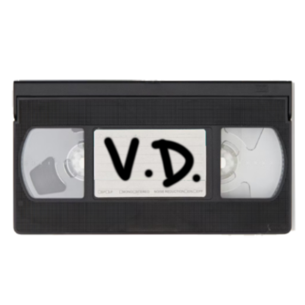

<div align="center">
  <h1>Video Destination</h1>
  <p>A clutter-free media streaming site</p>
  
</div>

## Screenshots

<div style="display: flex; flex-wrap: wrap; justify-content: center; gap: 6px; margin-top: 1rem;" align="center">
  
  
  
  
</div>

## Overview

**Video Destination** is a sleek, responsive Next.js application built as a custom interface for [VidSrc](https://vidsrc.xyz). Originally developed for personal use, it simplifies the process of watching movies and TV shows through a clean and intuitive UI — without the bloat.

## Features

- **TV Series Controls** — Easily select season and episode numbers when watching series.
- **Watch History** — Saves previously watched items (locally), with automatic duplicate filtering.
- **Theatre Mode** — Toggle an immersive fullscreen experience with one click.
- **Responsive UI** — Fully responsive layout for desktop, tablet, and mobile.

## Getting Started

To run the project locally:

```bash
git clone https://github.com/s4nj1th/vid-dst.git
cd vid-dst
npm install
npm run dev
````

Then navigate to `http://localhost:3000` in your browser.

## License

This project — **Video Destination** — is licensed under the [MIT License](./LICENSE).
